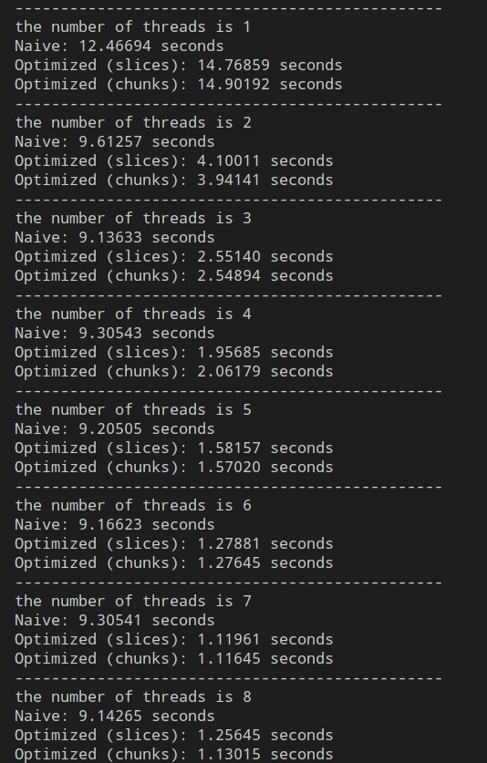

## Exercise 1 - OpenMP Hello World
    gcc -fopenmp -Wall -Wextra -std=gnu99 hello.c -o hello
    ./hello

tid not numerical order:
All child processes have the same priority
depend on previous.
(tid = 0, master thread)

## Exercise 2 - Matrix Multiplication
    gcc -fopenmp -Wall -Wextra -std=gnu99 matmul.c -o matmul
    ./matmul

**To be done**
(单线程pragma负提升?)
Describe the performance differences between the methods you implemented and try to analyze the reason(Run more times to find a common pattern instead of just running once).

Explain why using OpenMP may not necessarily lead to optimal performance on a single compute node with multiple cores.

1. The threads is not enough, for example, if the threads is only 1, which is the same as serial, then as OpenMP need to create threads, which is in need of time, so it is not optimal.
2. Some instructions can not be parallelized, for example, if there is relationship of data in a loop, then the OpenMP will need more time. 
3. Thread competition, for example, if more than one thread will write to the same memory, then the OpenMP will need more time to deal with it.
4. Memory bandwidth, for example, if the memory bandwidth is not enough, then the OpenMP will need more time to deal with it.

Bonus: Implement an additional optimization and discuss its impact on performance.

## Exercise 3 - Dot Product
    gcc -fopenmp -Wall -Wextra -std=gnu99 dotp.c -o dotp
    ./dotp