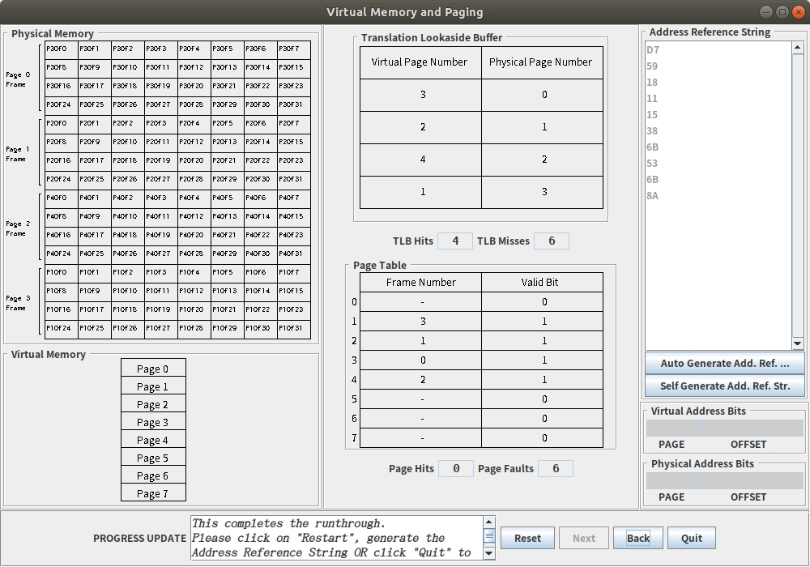
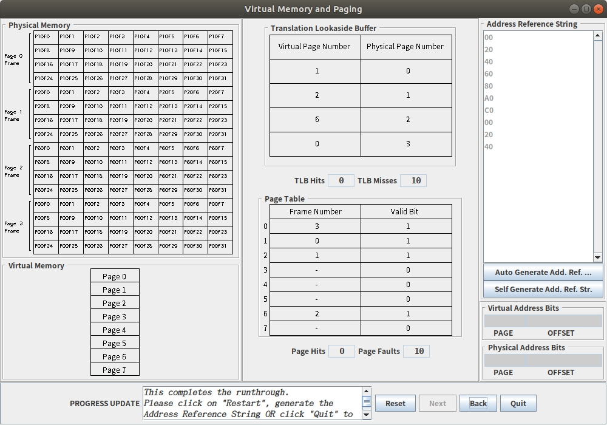

### run
java -jar camera-0.0.2.jar

## Exercise 1
VPN | offset
----|-------
3   |   5

How big are the pages in this model?
$2^5=32$

TLE  hits: 4, misses: 6
Page hits: 0. faults: 6

#### result in a Page Hit
the offset bits of the TBL and the Page are the same.
=> only visit the page table when TLB miss.

page_num = TLB_size => miss together

#### Explain the process by which we turn a virtual address into a physical address for the very first access (emphasizing on TLB Misses and Page Faults).
firstly get VPN 00
page : 000, offset 00000
TLB miss
page table do not have imformations of page0
page fault

## Exercise 2

#### ten memory accesses results in ten TLB Misses and ten Page Faults

00
20
40
60
80
a0
c0
e0
00
20

## Exercise 3
explain the single parameter change that would result in ten TLB misses, but fewer than ten page faults.

Let TLB 4->2
And the addresses are
00
20
40
60
00
20
40
60
00
20

TLB misses:10
Page faults: 4