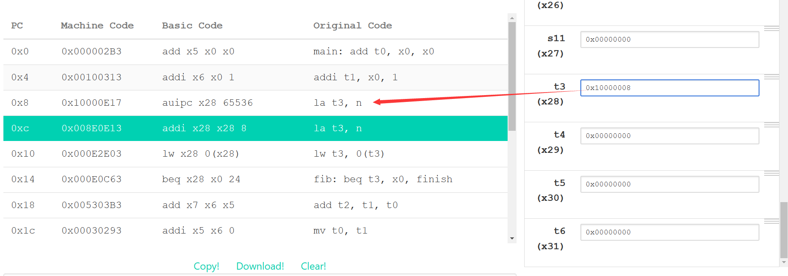
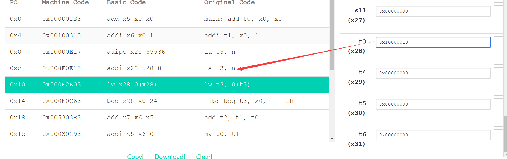
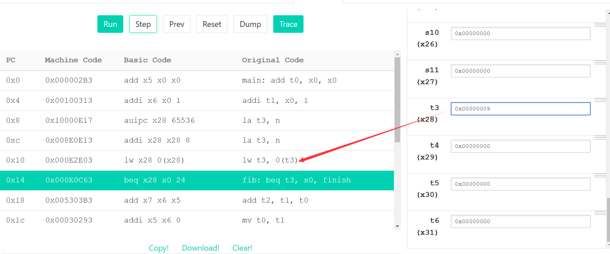

### What do the .data, .word, .text directives mean (i.e. what do you use them for)? Hint: think about the 4 sections of memory.

.data 声明以下初始化数据段 static data(Store subsequent items in the static segment at the next      available address)

.word 定义,分配空间 static data(Store listed values as unaligned 32-bit words.)

.test 声明以下代码段 code(Store subsequent instructions in the text segment at the next available address.)

### Run the program to completion. What number did the program output? What does this number represent?

34, the 9th element of Fibonacci sequence.

### At what address is n stored in memory? Hint: Look at the contents of the registers.

first  la t3, n

add upper immediate to pc

set t3:0x10000008

second la t3, n

add 8 to t3

set t3:0x10000010

load word

so the address of n is 0x10000010

### Without using the “Edit” tab, have the program calculate the 13th fib number (0-indexed) by manually modifying the value of a register. You may find it helpful to first step through the code. If you prefer to look at decimal values, change the “Display Settings” option at the bottom.

当运行到beq指令时，将register中t3(x28)值由 9 改为 13即可